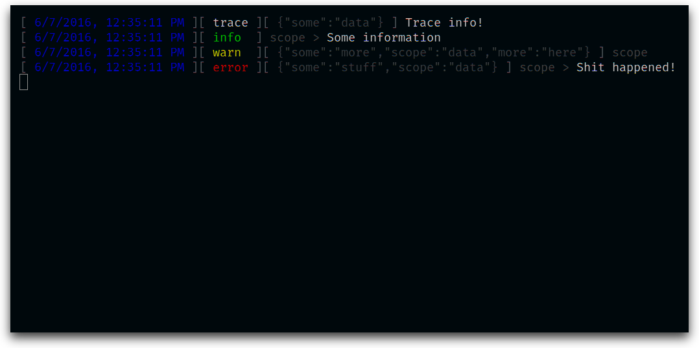

# A simple logger
This library provides a simple logger to use in your application.
It supports namespaces, custom reporters and outputs data as JSON (with the option to prettify output in development).

It is build atop of the [@paulavery/events](https://paulavery.github.io/events) library.

## Example
```js
import Logger from '@paulavery/logger';

let logger = new Logger({ debug: true });
/* A message and some data */
logger.trace('Trace info!', { some: 'data' });

let childLogger = logger.child('scope', { some: 'more', scope: 'data' });

/* Logging without data */
childLogger.info('Some information');

/* Logging without message */
childLogger.warn({ more: 'here' });

/* Overriding scope */
childLogger.error('Shit happened!', { some: 'stuff' });
```

**JSON output (`debug = false`)**
```json
{"time":1465295505440,"scope":[],"level":"trace","message":"Trace info!","data":{"some":"data"},"levelNumeric":0}
{"time":1465295505444,"scope":["scope"],"level":"info","message":"Some information","levelNumeric":100}
{"time":1465295505445,"scope":["scope"],"level":"warn","data":{"some":"more","scope":"data","more":"here"},"levelNumeric":200}
{"time":1465295505445,"scope":["scope"],"level":"error","message":"Shit happened!","data":{"some":"stuff","scope":"data"},"levelNumeric":300}
```

**Debug output**

